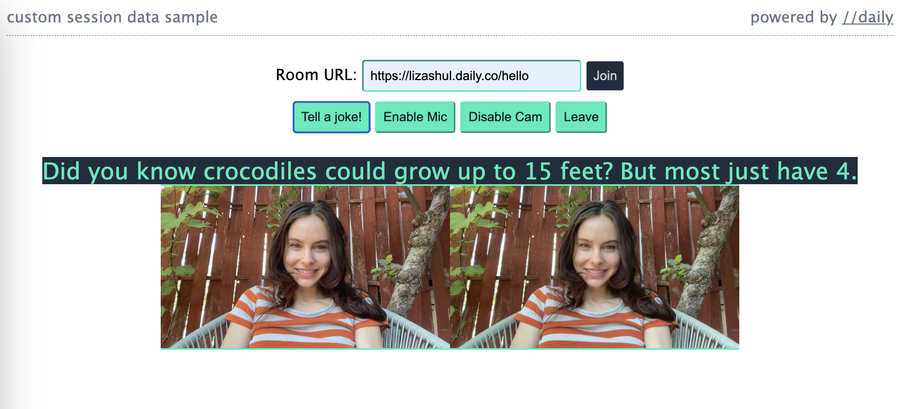

# Daily chat + reaction recording with VCS

This demo shows developers how they can embed chat and emoji reaction components into their recording of a Daily-powered video call.



## Running the demo locally

Run the following commands in your terminal:

```bash
git clone git@github.com:daily-demos/vcs-chat-recording.git
cd vcs-chat-recording
npm i
npm run dev
```

Then, navigate to the port shown in your terminal output. This will likely be `http://localhost:8080`