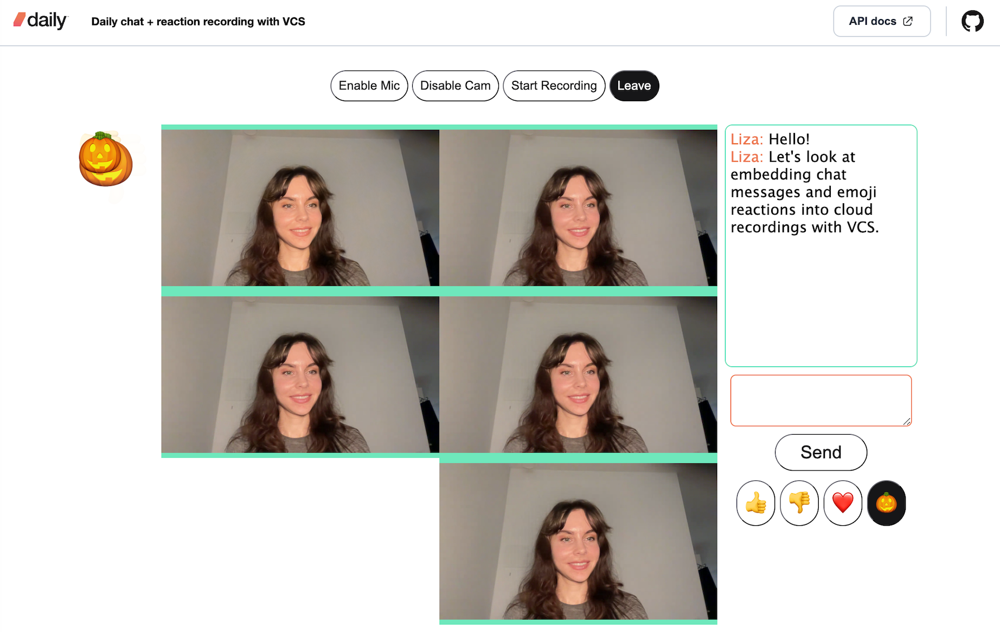
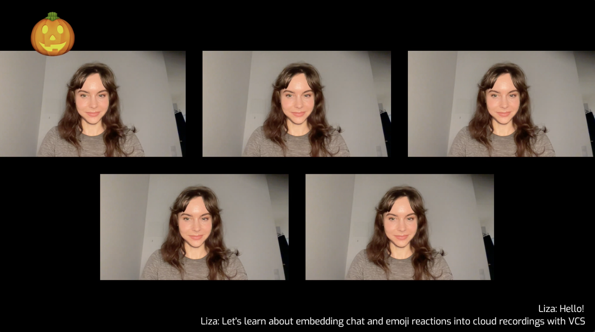
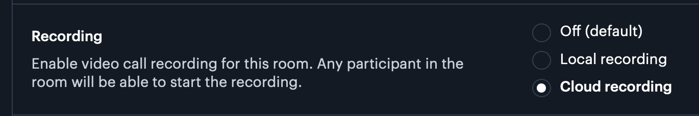

# Daily chat + reaction recording with VCS

This demo shows developers how they can embed chat and emoji reaction components into their recording of a Daily-powered video call. It uses Daily's [Video Component System (VCS)](https://docs.daily.co/reference/vcs), which enables you to apply layers over your video call recordings to capture additional visual information from the call, like participant emoji reactions.

## In-call view

*Emojis are rendered at varying sizes and opacities to enable satisfying "emoji spam".*

## Recording view

*Recordings have chat and emoji reactions embedded in the bottom right and upper left corners respectively.*


## Running the demo locally

You'll need a [Daily account](https://dashboard.daily.co/u/signup) and [a Daily room](https://dashboard.daily.co/rooms/create) with cloud recording enabled on creation:



(Note that cloud recording is a [pay-as-you-go feature with usage-based pricing](https://www.daily.co/pricing/).)

Then, run the following commands in your terminal:

```bash
git clone git@github.com:daily-demos/vcs-chat-recording.git
cd vcs-chat-recording
npm i
npm run dev
```

Finally, navigate to the port shown in your terminal output. This will likely be `http://localhost:8080`

Paste the URL of your Daily room into the join form, enter a nickname, and click "Join".

Once you've joined, click "Start Recording". Then, use the emoji buttons and chat box to interact with other call participants (or just with yourself :)). After stopping the recording, you can download it from the Daily dashboard to confirm the emoji reactions and chat messages were included in the recording.